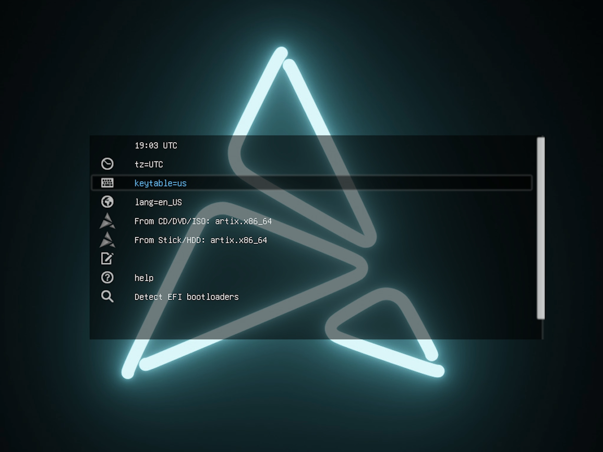
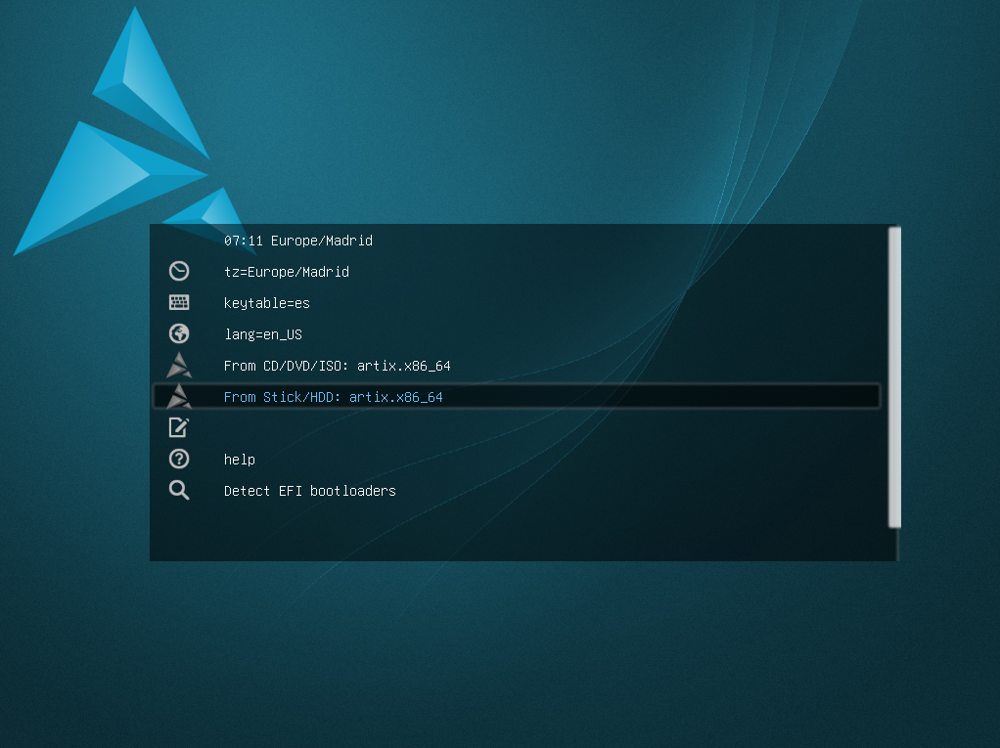
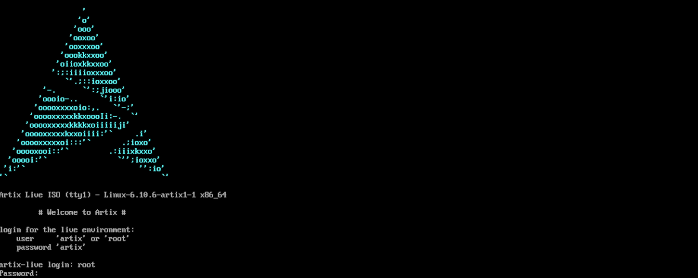
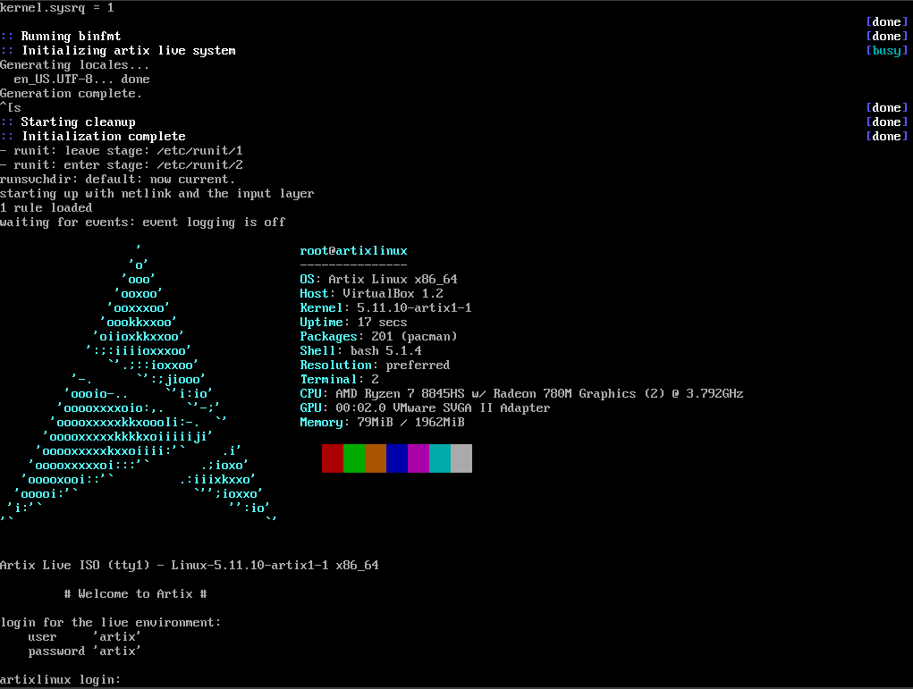

# 🤔 ¿Cómo Instalar Artix Base Runit?
- [🤔 ¿Cómo Instalar Artix Base Runit?](#-cómo-instalar-artix-base-runit)
  - [Introducción](#introducción)
  - [Descargar ISO](#descargar-iso)
    - [Problemas con la versión de 2025 de la ISO](#problemas-con-la-versión-de-2025-de-la-iso)
    - [Lowmem Version](#lowmem-version)
  - [Pantalla Inicial (antes del login)](#pantalla-inicial-antes-del-login)
    - [Lowmem Version](#lowmem-version-1)
  - [Login](#login)
    - [Lowmem Version](#lowmem-version-2)
  - [Particionado de la unidad de almacenamiento](#particionado-de-la-unidad-de-almacenamiento)
    - [¿Cómo sabemos si nuestra unidad de almacenamiento es /dev/sda?](#cómo-sabemos-si-nuestra-unidad-de-almacenamiento-es-devsda)
    - [¿Qué particiones crear y por qué?](#qué-particiones-crear-y-por-qué)
    - [Formatear particiones](#formatear-particiones)
    - [Montar particiones](#montar-particiones)
  - [Instalación del sistema base + linux-zen + runit](#instalación-del-sistema-base--linux-zen--runit)
  - [Fstab](#fstab)
  - [Chroot](#chroot)
  - [Configuración básica](#configuración-básica)
    - [Zona horaria](#zona-horaria)
    - [Locales](#locales)
    - [Hostname](#hostname)
    - [Crear contraseña para root](#crear-contraseña-para-root)
  - [Generar initramfs](#generar-initramfs)
  - [Instalar rEFInd](#instalar-refind)
  - [Configurar red (runit)](#configurar-red-runit)
  - [Crear usuario y añadirlo al sudoers](#crear-usuario-y-añadirlo-al-sudoers)
  - [Salir, desmontar y reiniciar](#salir-desmontar-y-reiniciar)
  - [Instalar Emulador de Terminal (Alacritty), Tiling Window Manager (DWM) y Gestor de pantalla y sesiones (LightDM)](#instalar-emulador-de-terminal-alacritty-tiling-window-manager-dwm-y-gestor-de-pantalla-y-sesiones-lightdm)
  - [Configurar el idioma de teclado](#configurar-el-idioma-de-teclado)

## Introducción
¿Quieres instalar Artix Base Runit y no sabes por dónde empezar? Pues estás en el lugar indicado. Como habrás podido leer en el [README](../../README.es.md) del repositorio, si tenemos una guía de instalación de un sistema operativo, tenemos un tutorial en [YouTube](). Si entras y lo ves, podrás comprobar que hemos llevado a cabo la instalación de la distro anteriormente mencionada en una máquina virtual (utilizando [Oracle VirtualBox](https://www.virtualbox.org/)), eso no quita que tú no puedas instalarlo en un PC o portátil. La única diferencia es que antes tendrás que crear un USB booteable, para ello podrás usar programas como:
* [Rufus](https://rufus.ie/)
* [balenaEtcher](https://etcher.balena.io/)

## Descargar ISO
Para descargar la ISO, vamos a ir a la [sección de descargas de la web oficial de Artix](https://artixlinux.org/download.php). Acto seguido, nos desplazamos hacia abajo hasta encontrar la sección **Official ISO images** y la tenemos en **Stable ISO images** dentro de **base** (_artix-base-runit-[...]-x86_64.iso_).

### Problemas con la versión de 2025 de la ISO
Una vez tenía descargada la ISO y me disponía a instalar la distro, me topé con un problema, "Login incorrect". En esta distro, es necesario iniciar sesión con un usuario y contraseña que Artix nos aporta para continuar con la instalación, pues en la versión de 2025 de la ISO, da error con cualquier combinación de contraseña y password.
```bash
user = 'root' or 'artix'
password = 'artix'
```

Estuve buscando información sobre el error y sus posibles soluciones, pero, al parecer, no hay nada que hacer hasta que no lo arreglen. No sé exactamente si soy la única persona que se ha topado con dicho error, en caso de estar equivocándome y de existir una solución, ante todo pido disculpas y te animo a hacérmela llegar (nunca es tarde para aprender).

Entonces, ¿qué hacemos? ¿No instalamos la distro y ya está?

No, lo más sencillo en este caso es recurrir a una distro antigua de Artix Base Runit. En este caso, yo he llevado a cabo la instalación con la versión de 2024, en esta ISO no se presenta el problema que hemos explicado unas líneas atrás.

La ISO de 2024 se encuentra en [la misma página de descargas](https://artixlinux.org/download.php), pero en la sección **Old and archived ISO images**, concretamente, en **Old ISO images (click to expand)** dentro de **base**.

### Lowmem Version
Existe una apartado en la [página web de Artix donde hay **Testing ISO downloads**](https://iso.artixlinux.org/testing-isos.php), aquí, podemos encontrar una versión de dicha distro que se basa en Arch low-memory. También se puede encontrar esta sección de **Testing ISO downloads** de cara al final de la [página web oficial de Artix](https://artixlinux.org/download.php).

> [!WARNING]
> Esta versión low-memory, al ser de 2021, tiene problemas a la hora de la instalación de distintos paquetes necesarios, llegando a un punto donde **sudo** y **pacman** se rompe. Por lo cual, recomiendo llevar a cabo la instalación con la stable ISO.

> [!NOTE]
> De todas formas, puedes seguir leyendo la guía. Se han ido poniendo los cambios respecto la instalación normal (stable ISO) y la instalación con la ISO low-memory, pero se llega a un punto donde nos es imposible continuar con la versión low-memory y se continua con la versión stable.

## Pantalla Inicial (antes del login)


Aquí, lo que tenemos que hacer es ir cambiando el ***time zone (tz)***, el ***idioma del teclado (keytable)*** y el ***idioma de la distro (lang)*** en caso de no estar a nuestro gusto. Por ejemplo, yo el ***idioma de la distro (lang)*** lo he mantenido en inglés, sin embargo, he cambiado el ***time zone (tz)*** y el ***idioma del teclado (keytable)***.

### Lowmem Version


En el caso de la versión low-memory, tenemos un estilo en la pantalla inicial algo diferente, pero, al fin y al cabo, es exactamente lo mismo.

>[!NOTE]
> En este menú inicial nos tenemos mover con el teclado.

Para salir y continuar con la instalación, tenemos que presionar ***From Stick/HDD: artix.x86_64***.

## Login


En Artix, tenemos un login inicial que debemos de hacer correctamente para poder empezar a introducir los comandos necesarios para completar la instalación de la distro.
```bash
user = 'root'
password = 'artix'
```

### Lowmem Version


En el caso de la versión low-memory, en el login inicial no podemos iniciar sesión como superusuario. Iniciamos sesión con las siguientes credenciales:
```bash
user = 'artix'
password = 'artix'
```

> [!IMPORTANT]
> Al no estar como superusuario (root), tendremos que ejecutar todo con **sudo** o elevarnos a superusuario con **sudo su**.

## Particionado de la unidad de almacenamiento
Para el particionado de la unidad de almacenamiento, vamos a utilizar una herramienta con una interfaz de tipo texto como es **cfdisk**. Para entrar a crear particiones en nuestra unidad, tenemos que introducir el siguiente comando:
```bash
cfdisk /dev/sda
```

En el caso de la versión low-memory, tenemos que hacer lo mismo, pero con **sudo**:
```bash
sudo cfdisk /dev/sda
```

### ¿Cómo sabemos si nuestra unidad de almacenamiento es /dev/sda?
Normalmente, Linux nombra las unidades de almacenamiento por orden de detección, por lo que, siempre que la unidad esté conectada mediante SATA/IDE/SCSI, va a ser **/dev/sda**.

Si se trata de un NVMe, si que puede ser algo distinto, **/dev/nvme0n1**. En cualquier caso, si queremos comprobarlo, podemos ejecutar comandos como:
```bash
lsblk
```
```bash
fdisk -l
```

### ¿Qué particiones crear y por qué?
| **Partición** | **Tamaño**       | **Función**                                                                                                                                                                                                                                                                                                                                                                                                                                                                                                                                 |
| ------------- | ---------------- | ------------------------------------------------------------------------------------------------------------------------------------------------------------------------------------------------------------------------------------------------------------------------------------------------------------------------------------------------------------------------------------------------------------------------------------------------------------------------------------------------------------------------------------------- |
| EFI           | 512 MB           | Es para el arranque UEFI, lo que va a contener son cargadores de arranque. No necesita mucho espacio, con el espacio asignado debería ser suficiente, alguna gente le asigna más y otra gente menos.                                                                                                                                                                                                                                                                                                                                        |
| Swap          | 8 GB             | Área de intercambio de memoria, se utiliza para hibernar o por si faltase memoria RAM. Tradicionalmente se le ponían el doble de GB que los que teníamos instalados de RAM, pero, con la evolución del hardware y el aumento de GB en cuanto a memoria RAM, podemos no cumplir dicha regla. El único problema que nos encontraríamos si quisiéramos asignar menos espacio del que tenemos en memoria RAM es que no podríamos hibernar, ya que para llevar a cabo dicha tarea necesitamos como mínimo los mismos GB que tenemos de RAM.      |
|               |                  | Ejemplo: Si tenemos 2gb de RAM, lo lógico sería poner el doble (4). Si tenemos 4gb de RAM, repetimos, aunque en ambos casos podemos poner más del doble para ir sobrados. Si tenemos 32gb RAM, podríamos poner de swap entre 8-16gb (si no queremos hibernación) y de 32 en adelante si sí queremos dicha característica.                                                                                                                                                                                                                   |
|               |                  | Digamos que las cifras de swap que hoy en día se pueden manejar son entre 4 y 16gb (sin hibernación) y, con hibernación, los GB que tenemos de RAM en adelante.                                                                                                                                                                                                                                                                                                                                                                             |
| / (root)      | 30 GB            | Es la partición raíz (root), aquí tenemos todo el sistema operativo y las aplicaciones. En este caso, los valores recomendados de espacio serían entre los 20 y 50gb siendo 30gb suficiente.      Ojo, que sea popular una serie de números de GB en esta partición, no significa que no podammos asignar más o menos GB.                                                                                                                                                                                                                   |
| /home         | espacio restante | Contiene todos tus archivos personales.                                                                                                                                                                                                                                                                                                                          Podríamos tener estos archivos dentro de / (root) y eliminar /home, pero lo que ganamos con esta configuración es la posibilidad de reinstalar Linux sin perder tus datos. |

### Formatear particiones

| Partición | Formato | Motivo                                                                                                                                                                                                                                                      |
| --------- | ------- | ----------------------------------------------------------------------------------------------------------------------------------------------------------------------------------------------------------------------------------------------------------- |
| EFI       | FAT32   | El estándar UEFI únicamente arranca desde particiones con dicho formato.                                                                                                                                                                                    |
| Swap      |         | Esta partición es algo particular, ya que "swap" no es un sistema de archivos. Simplemente es un espacio en la unidad de almacenamiento que el kernel utiliza como extensión de la RAM. Entonces, lo que hacemos realmente no es formatear, es inicializar. |
| / (root)  | ext4    | Para esta partición es necesario un sistema de archivos robusto que tenga una serie de características y, en Linux, el estándar es dicho formato.                                                                                                           |
| /home     | ext4    | En esta partición, pasa lo mismo que en la partición raíz (/).                                                                                                                                                                                              |

Una vez que ya sabemos los formatos a los que tenemos que formatear cada partición, vamos a ejecutar los siguientes comandos:
* **EFI - FAT32**
  ```bash
  mkfs.fat -F32 /dev/sda1
  ```
* **Swap**
  ```bash
  mkswap /dev/sda2
  ```
* **/ (root) - EXT4**
  ```bash
  mkfs.ext4 /dev/sda3
  ```
* **/home - EXT4**
  ```bash
  mkfs.ext4 /dev/sda4
  ```

En el caso de la versión low-memory, tenemos que hacer lo siguiente:
* **/ (root) - EXT4**
  ```bash
  sudo mkfs.ext4 /dev/sda3
  ```
* **/home - EXT4**
  ```bash
  sudo mkfs.ext4 /dev/sda4
  ```
* **Swap**
  ```bash
  sudo mkswap /dev/sda2
  ```

No hemos formateado la partición **EFI** debido a que esta versión de Artix Base Runit viene sin tener pre-instaladas muchas herramientas, entre ellas, **dosfstools**. Dicha herramienta es la que trae el **mkfs.fat -F32** para formatear la partición **EFI** a **FAT32**.
```bash
sudo pacman -S dosfstools
```

Cuando intentamos llevar a cabo la instalación de dicho paquete, nos salta el siguiente mensaje de warning:
```bash
warning: database file for 'system' does not exist (use '-Sy' to download)
warning: database file for 'world' does not exist (use '-Sy' to download)
warning: database file for 'galaxy' does not exist (use '-Sy' to download)
warning: database file for 'extra' does not exist (use '-Sy' to download)
warning: database file for 'community' does not exist (use '-Sy' to download)
error: target not found: dosfstools
```

Esto ocurre porque las bases de datos que está reconociendo **pacman** no están en esta versión de Artix, por lo cual, lo que hay que hacer es editar el archivo de configuración de dicho gestor de paquetes para que se dejen de reconocer.
```bash
sudo nano /etc/pacman.conf
```

Y lo que tenemos que hacer es comentar lo siguiente:
```bash
[extra]
Include = /etc/pacman.d/mirrorlist-arch

[community]
Include = /etc/pacman.d/mirrorlist-arch
```

Cuando guardamos y salimos del editor, tenemos que ejecutar el siguiente comando para sincronizar las bases de datos de paquetes:
```bash
sudo pacman -Syy
```

Ahora, ya podemos instalar el paquete **dosfstools**:
```bash
sudo pacman -S dosfstools
```

Una vez que ya tenemos dicho paquete, ya podemos formatear la partición **EFI**. El problema es que siguen apareciendo errores al intentar formatear la partición:
```bash
version `GLIBC_2.38' not found
version `GLIBC_2.34' not found
version `GLIBC_ABI_DT_RELR' not found
```

Esto se debe a la antigüedad de esta distro lowmem en concreto, ya que, si hacemos:
```bash
sudo pacman -Syyu
```

Nos aparecen errores debido a que dependencias como **hwids** y **eudev**, con el tiempo, han sido eliminados de los repositorios de paquetes. Entonces, la solución que tenemos es intentar migrar lo desactualizado manualmente, ya que la otra opción sería cambiar la ISO por una más nueva (cosa que no hay en la versión lowmem). Para ello, hacemos lo siguiente:
```bash
sudo pacman -Rdd eudev
```
```bash
sudo pacman -Scc
```
```bash
sudo pacman -Sy pacman archlinux-keyring artix-keyring
```

Una vez hemos hecho esto, nos damos cuenta que **sudo** y **pacman** han dejado de funcionar. Esto se debe a que nuestra **glibc** tiene la versión 2.33. Cuando se ha ejecutado el último comando mencionado, se han descargado paquetes para **glibc** 2.34, 2.38... que requieren de funciones que la versión que nosotros tenemos no tiene. Lo que obtenemos de todo esto es que, cuando intentamos usar **sudo** o **pacman**, nos aparecen cosas com estas:
```bash
libcrypto.so.1.1: cannot open shared object file
```
Cuando nos aparece un error de este tipo, quiere decir que no podemos cargar **sudo** o **pacman** debido a sus dependencias a librerías que, en nuestro sistema, no existen.

Llegados a este punto, donde está siendo muy complicado avanzar con la versión low-memory, no vamos a avanzar con dicha versión y vamos a continuar con la instalación para las stable ISO (dejamos la resolución de esto para próximas entregas).

En cualquier caso, si sabes cómo se soluciona esto o cómo instalar la versión low-memory por completo, te animo a contactarme o a ponerme un comentario en el vídeo de Artix Base Runit de mi canal de YouTube para saber en qué estamos fallando, qué es lo que nos falta y demás.

### Montar particiones
Cuando ya tenemos las particiones creadas y formateadas, necesitamos montarlas. Montar cada partición es necesario para que el sistema las utilice, ya que, Linux, organiza todo dentro de un árbol único de directorios que empiezan en ***/*** y, por defecto, las particiones no vienen asignadas a un elemento específico del árbol, eso lo tenemos que hacer nosotros.

1. Para montar la raíz, hacemos lo siguiente:
   ```bash
   mount /dev/sda3 /mnt
   ```
   Aquí, ***/mnt*** actúa como raíz provisional del nuevo sistema.

2. Para montar EFI en ***/boot***, hacemos lo siguiente:
   ```bash
   mkdir /mnt/boot
   ```
   ```bash
   mount /dev/sda1 /mnt/boot
   ```
   Gracias a esto, el bootloader se instalará ahí.

3. Para montar ***/home***, hacemos lo siguiente:
   ```bash
   mkdir /mnt/home
   ```
   ```bash
   mount /dev/sda4 /mnt/home
   ```
   Gracias a esto, los datos del usuario quedarán en su propia partición.

4. Para activar la ***/swap***, hacemos lo siguiente:
   ```bash
   swapon /dev/sda2
   ```
   Con esto, hacemos que la partición swap esté lista para cuando se necesite.

## Instalación del sistema base + linux-zen + runit
Ahora, vamos a instalar todo lo mínimo e indispensable para nuestra distro. Para ello, vamos a utilizar **basestrap** que es el encargado de copiar los paquetes seleccionados en la partición raíz que acabamos de montar (/mnt).

A continuación, vamos a ver el comando completo y vamos a ir viendo poco a poco qué es cada uno de los paquetes que estamos instalando.
```bash
basestrap /mnt base base-devel linux-zen linux-zen-headers linux-firmware \
  runit elogind-runit dhcpcd-runit sudo
```
* **base**

  Conjunto mínimo de paquetes para tener un sistema Arch (o distros basadas en Arch) funcional (shell, utilidades básicas, núcleo del sistema...).

* **base-devel**

  Herramientas de compilación (gcc, make...). Útil para instalaciones que requieran de compilación.

* **linux-zen**

  Versión del kernel de Linux modificada para mejorar la capacidad de respuesta y la latencia en entornos de escritorio, juegos y multimedia, priorizando la interacción fluida del usuario.

* **linux-zen-headers**

  Cabeceras del kernel necesarias para instalar drivers o módulos externos.

* **linux-firmware**

  Firmware para tarjetas gráficas, Wi-Fi, Bluetooth... Sin esto, hay hardware que no funciona.

* **runit**

  Sistema de inicialización alternativo a systemd. Es ligero, rápido y sencillo.

* **elogind-runit**

  Implementación de login/session manager para runit (sustituto de logind de systemd). Necesario para que sesiones gráficas y permisos de usuarios funcionen bien.

* **dhcpcd-runit**

  Cliente DHCP + integración con runit, necesario para tener red automática (IP por DHCP).

* **sudo**

  Permite ejecutar comandos como root desde un usuario normal con permisos. Imprescindible para administrar el sistema sin tener que iniciar sesión como root.

## Fstab
Una vez llegados a este punto, tenemos que lanzar el siguiente comando. Comando, que nos servirá para definir cómo se van a montar las particiones automáticamente cada vez que se arranque el sistema.
```bash
fstabgen -U /mnt >> /mnt/etc/fstab
```
> [!NOTE]
> **fstab** es un archivo de configuración de Linux donde se especifica qué particiones usar, dónde montarlas, con qué sistema de archivos y demás.

## Chroot
Chroot significa "change root", en español, cambiar raíz y lo que hace es hacer que un directorio actúe como la raíz del nuevo sistema que estamos instalando sin necesidad de reiniciar.

En el caso de Artix, el comando es ***artix-chroot***, que es una versión del chroot original preparada para dicha distro. Lo que hace por detrás el comando anteriormente mencionado es lo siguiente:
1. Entra al nuevo sistema (/mnt).
2. Monta y transfiere cosas necesarias del entorno actual (como /proc, /sys, /dev...) para que el nuevo sistema funcione como si ya estuviera arrancado. 

En definitiva, lo que hace es que la raíz provisional (/mnt) se convierta en la raíz real del sistema.

```bash
artix-chroot /mnt
```

## Configuración básica
### Zona horaria
```bash
ln -sf /usr/share/zoneinfo/Europe/Madrid /etc/localtime
```
Este comando enlaza tu zona horaria (en este caso, estamos en España, por tanto, escogemos Europe/Madrid) con el directoria ***/etc/localtime***, que es el directorio que Linux utiliza para saber la hora correcta.

```bash
hwclock --systohc
```
Este comando sincronizamos el reloj de hardware (BIOS/UEFI) con la hora del sistema.

### Locales
```bash
echo "es_ES.UTF-8 UTF-8" >> /etc/locale.gen
```
De esta manera le decimos al sistema qué idioma soportar, en este caso, el idioma seleccionado es el español, podría ser otro cualquiera (inglés de Reino Unido, "en_GB.UTF-8 UTF-8" o de EE.UU. "en_US.UTF-8 UTF-8").

```bash
locale-gen
```
Este comando genera los archivos de idioma necesarios.

```bash
echo LANG=es_ES.UTF-8 > /etc/locale.conf
```
De esta manera definimos el idioma principal del sistema.

### Hostname
```bash
echo artixvbox > /etc/hostname
```
De esta manera definimos el nombre del ordenador dentro de la red.

```bash
cat >> /etc/hosts <<EOF
127.0.0.1 localhost
::1       localhost
127.0.1.1 artixvbox.localdomain artixvbox
EOF
```
De esta manera enlazamos el nombre con la IP local para que todo funcione en red interna y servicios.

### Crear contraseña para root
```bash
passwd
```
Este comando sirve para crear una contraseña a un usuario en específico, en este caso que no escribimos ningún nombre a la derecha del mismo, al root.

## Generar initramfs
Cuando instalamos un kernel en una distro basada en Arch como es Artix (en este caso, Base Runit), el sistema, aparte de copiar el binario del kernel, necesita un **initramfs** (initial RAM filesystem). Lo último mencionado, es un archivo comprimido que cuenta con los módulos básicos del kernel, los hooks de arranque y la configuración necesaria para que el sistema pueda montar el **root filesystem** (/).

Por lo tanto, tenemos que ejecutar el siguiente comando:
```bash
mkinitcpio -P
```
Este comando, genera **initramfs** para todos los kernels instalados en el sistema.

## Instalar rEFInd
```bash
pacman -S refind efibootmgr
```
Con este comando, estamos instalando el gestor de arranque rEFInd y la herramienta para manejar entradas UEFI.

```bash
refind-install
```
Este comando sirve para copiar los archivos de rEFInd a la partición EFI y lo registra en el firmware para que el ordenador pueda arrancar.

A continuación, lo que tenemos que hacer es ver el UUID de nuestra partición raíz (/) y ponerlo en el archivo de configuración **/boot/refind_linux.conf**, tanto en la primera línea como en la segunda:
```bash
blkid
```
Una vez hemos sacado el UUID de nuestra partición raíz (/), vamos a editar el siguiente archivo:
```bash
nano /boot/refind_linux.conf
```
Y añadimos el UUID en la primera y en la segunda línea:
```bash
"Boot with standard options" "lang=en_US keytable=es tz=Europe/Madrid label=ARTIX_202408 root=UUID=[...]"
"Boot to single-user mode" "lang=en_US keytable=es tz=Europe/Madrid label=ARTIX_202408 root=UUID=[...] single"
```

## Configurar red (runit)
```bash
sudo ln -s /etc/runit/sv/dhcpcd /etc/runit/runsvdir/default/
```
Con este comando, activamos el servicio de red dhcpcd en runit para, que al arrancar el sistema, se pida IP automáticamente y se tenga internet.

## Crear usuario y añadirlo al sudoers
```bash
useradd -m -G wheel -s /bin/bash username
```
```bash
passwd username
```
Con estos 2 comandos creamos un usuario normal y lo añadimos al grupo wheel (admins), también le asignamos bash como shell y le creamos una contraseña.

```bash
pacman -S nano
```
En el caso de que ya tengamos nano instalado, podemos omitir este comando, pero, si no, tenemos que ejecutarlo para instalar el editor anteriormente mencionado.
```bash
nano /etc/sudoers
```
```bash
%wheel ALL=(ALL) ALL
```
Acto seguido, abrimos el archivo ***/etc/sudoers*** con nano y buscamos la línea que has visto justo arriba. Una vez la encontremos, la descomentamos. De esta manera, cualquier usuario del grupo wheel, podrá utilizar sudo. 

## Salir, desmontar y reiniciar
```bash
exit
```
De esta manera, salimos del chroot y volvemos al entorno de la ISO.

```bash
umount -R /mnt
```
Con el comando anterior desmontamos todas las particiones de la unidad de almacenamiento.

```bash
reboot
```
Por último, reiniciamos.

## Instalar Emulador de Terminal (Alacritty), Tiling Window Manager (DWM) y Gestor de pantalla y sesiones (LightDM)
Actualmente, el sistema operativo arranca en TTY (interfaces de terminal que permiten a los usuarios interactuar con el sistema operativo) y nosotros queremos que tenga un inicio de sesión gráfico, un titling window manager y nuestro emulador de terminal favorito. Para ello, en primer lugar, tenemos que instalar un servidor gráfico (la base para el entorno de escritorio gráfico, GUI, en sistemas operativos tipo Unix). En este caso, instalaremos **Xorg**, ya que **DWM** (el tiling window manager que vamos a instalar) únicamente es compatible con este y no con otros como **Wayland**.

```bash
sudo pacman -Syu # para actualizar el sistema operativo antes de realizar la instalación de todo lo que viene a continuación
```

```bash
sudo pacman -S xorg-server xorg-xinit xorg-xrandr xorg-xsetroot xterm alacritty
```

Para probar el servidor gráfico, tenemos que ejecutar el siguiente comando:
```bash
startx
```
Una vez lo hemos ejecutado y hemos visto que funciona, tenemos que salir para continuar con la instalación:
```bash
exit
```

Ahora, antes de instalar **DWM**, tenemos que instalar las dependencias que dicho tiling window manager necesita:
```bash
sudo pacman -S git libxft libxinerama
```

Una vez hemos instalado las dependencias necesarias para el tiling window manager anteriormente mencionado, tenemos que obtener su codigo fuente, pero antes vamos a crear el directorio **.config**:
```bash
mkdir ~/.config
```

```bash
git clone git://git.suckless.org/dwm ~/.config/dwm
```
```bash
git clone git://git.suckless.org/st ~/.config/st
```
```bash
git clone git://git.suckless.org/dmenu ~/.config/dmenu
```

```bash
cd ~/.config/dwm && sudo make install
```
```bash
cd ~/.config/st && sudo make install
```
```bash
cd ~/.config/dmenu && sudo make install
```

Ya tendríamos instalado **DWM**, a continuación, instalaremos el gestor de pantalla y sesiones **LightDM**:
```bash
sudo pacman -S lightdm lightdm-gtk-greeter lightdm-gtk-greeter-settings
```

Ahora, tenemos que activar el servicio **lightdm**:
```bash
sudo ln -s /etc/runit/sv/lightdm /etc/runit/runsvdir/default/
```

Por último, tenemos que agregar **DWM** al menú de sesiones del gestor de pantalla y sesiones (en este caso **LightDM**):
```bash
sudo mkdir /usr/share/xsessions
```
```bash
sudo nano /usr/share/xsessions/dwm.desktop
```

Una vez hemos abierto el archivo para editarlo, añadimos lo siguiente:
```bash
[Desktop Entry]
Encoding=UTF-8
Name=Dwm
Comment=the dynamic window manager
Exec=dwm
Icon=dwm
Type=XSession
```

Por útlimo, lo que vamos a hacer es cambiar el emulador de terminal que **DWM** tiene por defecto, en este caso, **st**.
```bash
sudo nano ~/.config/dwm/config.h
```

Y cambiamos la siguiente línea:
```bash
static const char *termcmd[]  = { "st", NULL };
```

Por esta otra:
```bash
static const char *termcmd[]  = { "alacritty", NULL };
```

Y recompilamos posicionándonos en el directorio **~/.config/dwm**:
```bash
cd ~/.config/dwm
```
```bash
sudo make clean install
```

Por útlimo, vamos a tener que crear el directorio donde se va a encontrar el script de ejecución de lightdm:
```bash
sudo mkdir -p /etc/runit/sv/lightdm
```
Una vez tenemos el directorio, creamos el archivo que va a contener el script:
```bash
sudo nano /etc/runit/sv/lightdm/run
```
En dicho directorio, tenemos que añadir la siguiente línea:
```bash
exec 2>&1

export PATH=/usr/local/sbin:/usr/local/bin:/usr/sbin:/usr/bin:/sbin:/bin
export LANG=en_US.UTF-8
export HOME=/root
export XDG_RUNTIME_DIR=/run/lightdm

install -d -m 0700 -o root -g root /run/lightdm

exec /usr/sbin/lightdm
```
Una vez que guardamos el archivo y salimos, tenemos que darle permisos de ejecución:
```bash
sudo chmod +x /etc/runit/sv/lightdm/run
```
EL penúltimo paso sería crear el link con el directorio de inicio de servicios "por defecto" (junto al inicio del sistema):
```bash
sudo ln -s /etc/runit/sv/lightdm /etc/runit/runsvdir/default/
```
Y levantamos el servicio:
```bash
sudo sv start lightdm
```

> [!WARNING]
> No he conseguido que lightdm arranque junto al sistema operativo. Con el archivo run que hemos visto anteriormente únicamente me ha arrancado 1 vez el servicio de lightdm y, al reinciar, ya no ha arrancado más. Es mi primera vez con runit y no sé que es lo que pasa, tampoco encuentro información sobre el inconveniente que estamos teniendo con Artix Base Runit y LightDM. En caso de que sepas cómo solucionar el error, te invito a hacer una PR o, en su defecto, a hacérmelo saber a través de algún medio de comunicación (YouTube, TikTok, LinkedIn...).

## Configurar el idioma de teclado
Para terminar, tenemos que configurar el idioma del teclado para evitar tener que hacer un **sudo loadkeys es** cada vez que iniciamos el sistema. Para ello, tenemos que editar el siguiente archivo:
```bash
sudo nano /etc/vconsole.conf
``` 
Y añadimos lo siguiente:
```bash
KEYMAP=es
```